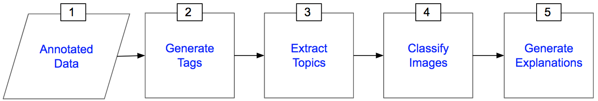

# PEAK: Explainable Privacy Assistant through Automated Knowledge Extraction

[](https://www.python.org/downloads/release/python-380/)
[](https://opensource.org/licenses/MIT)
[](https://github.com/psf/black)

PEAK is a privacy assistant that explains privacy labels by generating human-understandable explanations. This refactored version transforms the original research prototype into a production-ready, maintainable machine learning system.

## 🚀 Features

- **Modular Architecture**: Clean separation of concerns with well-defined modules
- **Configuration Management**: Environment-based configuration with validation
- **Comprehensive Testing**: Unit tests, integration tests, and quality assurance
- **Documentation**: Complete API documentation and user guides
- **Development Tools**: Pre-commit hooks, linting, formatting, and type checking
- **Logging & Monitoring**: Structured logging with configurable output formats
- **Extensible Design**: Abstract interfaces for easy extension and customization

## 📋 System Overview

PEAK consists of five main stages:

1. **Tag Generation**: Uses Clarifai API to generate descriptive tags for images
2. **Topic Extraction**: Applies NMF (Non-negative Matrix Factorization) with TF-IDF to extract latent topics
3. **Image Classification**: Trains Random Forest classifier for privacy prediction
4. **Explanation Generation**: Categorizes explanations into four types: Dominant, Opposing, Collaborative, and Weak
5. **Visualization**: Generates visual and textual explanations for privacy decisions



## 🛠️ Installation

### Prerequisites

- Python 3.8 or higher
- pip package manager

### Quick Installation

```bash
# Clone the repository
git clone https://github.com/aycignl/peak.git
cd peak

# Install the package
pip install -e .
```

### Development Installation

```bash
# Install with development dependencies
make setup-dev

# Or manually:
pip install -e ".[dev,test]"
pre-commit install
```

## ⚙️ Configuration

1. Copy the environment template:
   ```bash
   cp .env.template .env
   ```

2. Edit `.env` with your configuration:
   ```bash
   # Clarifai API Configuration
   CLARIFAI_USER_ID=your_user_id_here
   CLARIFAI_PAT=your_personal_access_token_here
   CLARIFAI_APP_ID=your_app_id_here
   
   # Data Paths
   DATA_DIR=./data
   MODELS_DIR=./models
   
   # Model Configuration
   N_TOPICS=20
   RANDOM_STATE=333
   ```

## 🚦 Quick Start

### Basic Usage

```python
from peak import TrainingPipeline, InferencePipeline
from peak.config.settings import settings

# Initialize and run training pipeline
pipeline = TrainingPipeline()
results = pipeline.run()

# Make predictions
inference = InferencePipeline()
predictions = inference.predict(new_data)
```

### Step-by-Step Example

```python
import pandas as pd
from peak.data.loaders import DataLoader
from peak.models.topic_extraction import TopicExtractor
from peak.models.classification import PrivacyClassifier
from peak.models.explanation_generation import ExplanationGenerator

# Load data
loader = DataLoader()
train_df, test_df = loader.load_training_data()

# Extract topics
extractor = TopicExtractor(n_topics=20)
train_features = extractor.fit_transform(train_df['cleaned_tags'])
test_features = extractor.transform(test_df['cleaned_tags'])

# Train classifier
classifier = PrivacyClassifier()
classifier.fit(train_features, train_df['normalizedpublic'])

# Generate explanations
explainer = ExplanationGenerator()
explanations = explainer.generate_explanations(test_features, test_df)
```

### Command Line Interface

```bash
# Train a model
peak-train --data-dir ./data --output-dir ./models

# Make predictions
peak-predict --model-path ./models/classifier.pkl --input-file ./data/new_images.csv

# Generate explanations
peak-explain --model-path ./models --input-file ./data/test_images.csv --output-dir ./explanations
```

## 📊 Data Format

### Expected Data Structure
```
data/
├── dataset/
│   ├── df_train.csv          # Training data with image metadata and tags
│   ├── df_test.csv           # Test data
│   ├── train_df_shapley.csv  # SHAP values for training data
│   └── test_df_shapley.csv   # SHAP values for test data
└── pickle/
    ├── train_input.pickle    # Preprocessed training features
    ├── test_input.pickle     # Preprocessed test features
    ├── train_label.pickle    # Training labels
    └── test_label.pickle     # Test labels
```

### CSV Format

Your CSV files should contain:
- `image`: Image identifier
- `cleaned_tags`: Space-separated tags for the image
- `normalizedpublic`: Privacy label (1.0 for public, 0.0 for private)

## 🧪 Testing

Run the test suite:

```bash
# Run all tests with coverage
make test

# Run tests without coverage (faster)
make test-fast

# Run specific test files
pytest tests/test_config.py -v
```

## 🔧 Development

### Code Quality

```bash
# Format code
make format

# Run linting
make lint

# Type checking
make type-check

# Run all pre-commit checks
make pre-commit
```

### Documentation

```bash
# Build documentation
make docs

# Serve documentation locally
make docs-serve
```

### Project Structure

```
peak/
├── src/peak/              # Main package
│   ├── config/           # Configuration management
│   ├── data/             # Data loading and processing
│   ├── models/           # ML models and algorithms
│   ├── api/              # External API clients
│   ├── utils/            # Utility functions
│   └── pipeline/         # Pipeline orchestration
├── tests/                # Test suite
├── docs/                 # Documentation
├── examples/             # Example scripts and notebooks
├── configs/              # Configuration files
└── scripts/              # Utility scripts
```

## 📈 Performance & Scalability

- **Batch Processing**: Efficient handling of large image datasets
- **Parallel Processing**: Multi-threaded execution for CPU-intensive tasks
- **Memory Optimization**: Lazy loading and efficient data structures
- **Caching**: Model and data caching for improved performance
- **Monitoring**: Built-in logging and performance metrics

## 🔒 Security

- **Credential Management**: Secure handling of API keys and sensitive data
- **Input Validation**: Comprehensive data validation and sanitization
- **Error Handling**: Robust error handling and recovery mechanisms
- **Security Scanning**: Automated security checks with Bandit

## 🤝 Contributing

We welcome contributions! Please see our [Contributing Guidelines](CONTRIBUTING.md) for details.

1. Fork the repository
2. Create a feature branch
3. Make your changes
4. Add tests for new functionality
5. Ensure all tests pass
6. Submit a pull request

## 📄 License

This project is licensed under the MIT License - see the [LICENSE.md](LICENSE.md) file for details.

## 📚 Citations

If you use PEAK in your research, please cite:

```bibtex
@article{peak2023,
  title={PEAK: Explainable Privacy Assistant through Automated Knowledge Extraction},
  author={Gonul, Ayca and others},
  journal={IEEE Conference Proceedings},
  year={2023}
}
```

## 📞 Support

- **Issues**: [GitHub Issues](https://github.com/aycignl/peak/issues)
- **Email**: gonul.ayci@boun.edu.tr
- **Documentation**: [Read the Docs](https://peak.readthedocs.io/)

## 🗺️ Roadmap

- [ ] Deep learning model support
- [ ] Real-time inference API
- [ ] Web-based dashboard
- [ ] Docker containerization
- [ ] Cloud deployment guides
- [ ] Model versioning and MLOps integration

---

**Note**: This is a refactored version of the original PEAK research prototype, designed for production use with improved maintainability, testing, and documentation.